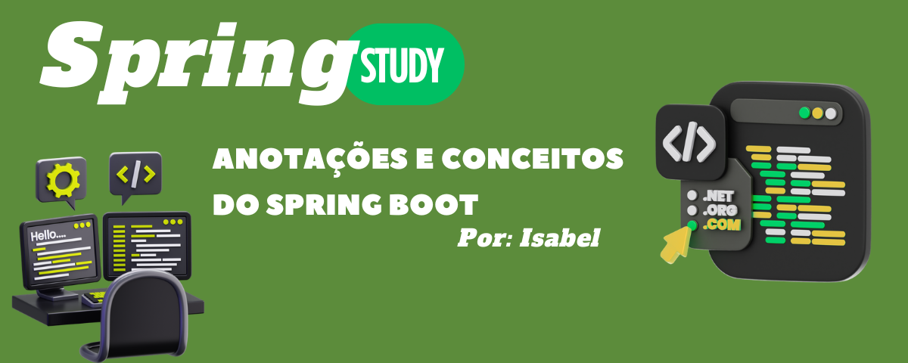

<div align="center">




# Spring Boot — Anotações de Estudo

Este repositório foi criado com o objetivo de servir como um guia de estudos e consulta sobre Spring Boot. Aqui são reunidas anotações, conceitos fundamentais, exemplos práticos e explicações das principais anotações e recursos utilizados no desenvolvimento de APIs Java com Spring.

O conteúdo é organizado de forma progressiva para auxiliar os estudos e compreender  os conceitos básicos.

</div>


## Índice

1. [Spring Boot](#1-spring-boot)
   - [@SpringBootApplication](#springbootapplication)

2. [Controllers](#2-controllers)
   - [@RestController](#restcontroller)
   - [@Autowired](#autowired)
   - [@RequestMapping](#requestmapping)
   - [@GetMapping](#getmapping)
   - [@PostMapping](#postmapping)
   - [@DeleteMapping](#deletemapping)
   - [@PutMapping](#putmapping)

3. [DTOs](#3-dtos)
   - [O que é um DTO?](#o-que-é-um-dto)
   - [Request DTO](#request-dto)
   - [Response DTO](#response-dto)

4. [Repository](#4-repository)
   - [O que é um Repository?](#o-que-é-um-repository)
   - [JpaRepository](#jparepository)
   - [Principais Métodos](#principais-métodos)
     - [save()](#save)
     - [findById()](#findbyid)
     - [findAll()](#findall)
     - [deleteById()](#deletebyid)
     - [existsById()](#existsbyid)
   - [Queries Personalizadas](#queries-personalizadas)

5. [Models (Entities)](#5-models-entities)
   - [O que é uma Model?](#o-que-é-uma-model)
   - [@Entity](#entity)
   - [@Table](#table)
   - [@Id](#id)
   - [@GeneratedValue](#generatedvalue)
   - [Estratégias de Geração de ID](#estratégias-de-geração-de-id)
     - [GenerationType.IDENTITY](#generationtypeidentity)
     - [GenerationType.UUID](#generationtypeuuid)
     - [GenerationType.SEQUENCE](#generationtypesequence)
     - [GenerationType.AUTO](#generationtypeauto)
   - [Qual devo utilizar?](#qual-devo-utilizar)
   - [Exemplo Completo](#exemplo-completo)
   - [Construtores](#construtores)

6. [Lombok](#6-lombok)
   - [O que é o Lombok?](#o-que-é-o-lombok)
   - [@Getter](#getter)
   - [@Setter](#setter)
   - [@NoArgsConstructor](#noargsconstructor)
   - [@AllArgsConstructor](#allargsconstructor)
   - [@ToString](#tostring)

7. [Próximos Tópicos](#próximos-tópicos)


<div align="center">

# 1. Spring Boot

</div>

## @SpringBootApplication

Indica que aquela classe é a classe principal da aplicação.

É responsável por iniciar o Spring Boot e realizar as configurações automáticas necessárias para o funcionamento do projeto.

Exemplo:

```java
@SpringBootApplication
public class Application {
    public static void main(String[] args) {
        SpringApplication.run(Application.class, args);
    }
}
```


<div align="center">

# 2. Controllers

</div>

As Controllers são responsáveis por receber as requisições do usuário e retornar respostas.

Elas funcionam como uma ponte entre o cliente e a aplicação.

## @RestController

Indica ao Spring que aquela classe será responsável por receber requisições HTTP e retornar respostas da API.

Exemplo:

```java
@RestController
@RequestMapping("/food")
public class FoodController {
}
```

## @Autowired

Realiza a injeção automática de dependências, evitando a criação manual de objetos utilizando `new`.

Exemplo:

```java
@Autowired
private FoodRepository foodRepository;
```

## @RequestMapping

Define a rota base da Controller.

Exemplo:

```java
@RequestMapping("/food")
```

Todas as rotas dessa Controller passarão a iniciar com `/food`. Cada requisição possui uma rota para cada tarefa distinta.

## @GetMapping

Responsável por buscar dados. Pode ou não receber parâmetros.

Exemplo para buscar todos os registros:

```java
   @GetMapping
    public List<FoodModel> get(){
        List <FoodModel> foodModel = foodRepository.findAll();
        return foodModel;

    }
```

Exemplo para buscar um registro específico:

```java
@GetMapping("/{id}")
public FoodModel getById(@PathVariable Integer id) {
    return foodRepository.findById(id);
}
```

## @PostMapping

Responsável por criar ou adicionar dados.

Na maioria dos casos recebe um corpo (`@RequestBody`) contendo as informações que serão cadastradas.

Exemplo utilizando `@RequestBody`:

```java
    @RequestMapping
        public ResponseEntity create(@RequestBody FoodModel food){
        foodRepository.save(food);
        return  ResponseEntity.status(HttpStatus.CREATED).body("Adicionado com sucesso!");
    }
```

Exemplo utilizando parâmetros:

```java
@PostMapping("/categoria/{id}")
public String createFood(
        @PathVariable Integer id,
        @RequestBody FoodModel foodModel) {

    return ResponseEntity.status(HttpStatus.CREATED).body("Adicionado com sucesso!");
}
```

Nesse caso o parâmetro é utilizado porque a comida está sendo criada dentro de uma categoria específica já existente. Apesar dessas possibilidades, em APIs REST é muito comum utilizar `@RequestBody`.

## @DeleteMapping

Responsável por remover dados.

Geralmente recebe o identificador do registro que será removido.

Exemplo:

```java
  @DeleteMapping("/{id}")
        public ResponseEntity delete(@RequestParam FoodModel food){
        foodRepository.deleteById(food.getId());
        return ResponseEntity.status(HttpStatus.OK).body("Deletado com sucesso");
    }
```

## @PutMapping

Responsável por atualizar dados.

Normalmente recebe o identificador do registro e um corpo contendo as novas informações.

Exemplo:

```java
    @PutMapping("/{id}")
    public ResponseEntity uptade(@PathVariable Integer id, @RequestBody FoodResponseDTO foodResponseDTO){

     Optional <FoodModel> food = foodRepository.findById(id);

     FoodModel response = food.get();

     response.setName(foodResponseDTO.name());
     response.setPrice(foodResponseDTO.price());
     response.setImage(foodResponseDTO.image());

     foodRepository.save(response);

     return ResponseEntity.status(HttpStatus.OK).body("Atualizado com suscesso");
    }
```


## @RequestBody

`@RequestBody` é utilizado para receber dados enviados no corpo da requisição HTTP, normalmente em formato JSON.

### Exemplo de JSON

```json
{
    "name": "Pizza",
    "price": 30,
    "image": "pizza.png"
}
```

### Exemplo no Controller

```java
@PostMapping
public ResponseEntity create(@RequestBody FoodRequestDTO dto){
    ...
}
```

O Spring converte automaticamente o JSON para um objeto Java.

### Quando utilizar?

Quando for necessário enviar objetos completos para a API.

---

## @RequestParam

`@RequestParam` é utilizado para receber parâmetros enviados na URL após o caractere `?`.

### Exemplo

```http
GET /foods?name=Pizza
```

### Exemplo no Controller

```java
@GetMapping
public ResponseEntity search(@RequestParam String name){
    ...
}
```

Valor recebido:

```java
name = "Pizza"
```

### Quando utilizar?

Quando for necessário enviar filtros, pesquisas ou parâmetros simples pela URL.

---

## @PathVariable

`@PathVariable` é utilizado para capturar valores presentes no caminho da URL.

### Exemplo

```http
GET /foods/1
```

### Exemplo no Controller

```java
@GetMapping("/{id}")
public ResponseEntity findById(@PathVariable Integer id){
    ...
}
```

Valor recebido:

```java
id = 1
```

### Quando utilizar?

Quando o valor faz parte da identificação do recurso.


<div align="center">

# 3. DTOs

</div>

## O que é um DTO?

DTO (Data Transfer Object) é um objeto utilizado para transferir dados entre o cliente e a API.

Seu objetivo é evitar expor diretamente as entidades do banco de dados. Além disso, permite controlar exatamente quais dados entram e saem da aplicação.

## Request DTO

Responsável por receber dados enviados pelo cliente.

Exemplo:

```java
public record FoodRequestDTO(
    String nome,
    Double preco,
    String imagem
) {}
```

## Response DTO

Responsável por retornar apenas os dados necessários para o cliente.

Exemplo:

```java
public record FoodResponseDTO(
    Integer id,
    String nome,
    Double preco
) {}
```

Exemplo de conversão:

```java
public record FoodResponseDTO(
    Integer id,
    String nome,
    Double preco
) {
    public FoodResponseDTO(FoodModel food) {
        this(
            food.getId(),
            food.getNome(),
            food.getPreco()
        );
    }
}
```


<div align="center">

# 4. Repository

</div>

## O que é um Repository?

O Repository é a camada responsável pela comunicação com o banco de dados.

Ele abstrai a complexidade das consultas SQL e fornece métodos prontos para realizar operações de CRUD (Create, Read, Update e Delete). Em vez de escrever SQL manualmente para operações básicas, o Spring Data JPA gera essas consultas automaticamente.

## JpaRepository

A forma mais comum de criar um repositório é estendendo a interface `JpaRepository`.

Exemplo:

```java
public interface FoodRepository
        extends JpaRepository<FoodModel, Integer> {
}
```

Onde:

- `FoodModel` é a entidade gerenciada pelo repositório.
- `Integer` é o tipo da chave primária da entidade.

## Como o Repository se relaciona com os DTOs?

O Repository trabalha apenas com entidades (Models) e não conhece DTOs.

Exemplo:

```java
Optional<FoodModel> food = foodRepository.findById(id);
```

## Principais Métodos

### save()

Responsável por salvar ou atualizar registros.

```java
foodRepository.save(food);
```

### findById()

Busca um registro através da chave primária.

```java
Optional<FoodModel> food = foodRepository.findById(id);
```

### findAll()

Retorna todos os registros.

```java
List<FoodModel> foods = foodRepository.findAll();
```

### deleteById()

Remove um registro através da chave primária.

```java
foodRepository.deleteById(id);
```

### existsById()

Verifica se um registro existe.

```java
boolean exists = foodRepository.existsById(id);
```

## Queries Personalizadas

O Spring consegue gerar consultas automaticamente a partir do nome dos métodos.

Exemplo:

```java
public interface FoodRepository
        extends JpaRepository<FoodModel, Integer> {

    List<FoodModel> findByNome(String nome);
}
```

Uso:

```java
List<FoodModel> foods = foodRepository.findByNome("Pizza");
```

O Spring gerará a consulta automaticamente.


<div align="center">

# 5. Models (Entities)

</div>

## O que é uma Model?

Uma Model (também chamada de Entity) representa uma tabela do banco de dados dentro da aplicação.

Cada objeto criado a partir dessa classe representa um registro da tabela. As Models são utilizadas pelo JPA para realizar operações no banco de dados.

## @Entity

Indica ao Spring e ao JPA que aquela classe representa uma entidade do banco de dados.

Exemplo:

```java
@Entity
public class FoodModel {
}
```

## @Table

Permite definir o nome da tabela no banco de dados.

Exemplo:

```java
@Entity
@Table(name = "foods")
public class FoodModel {
}
```

Caso essa anotação não seja utilizada, o JPA tentará criar a tabela utilizando o nome da classe.

## @Id

Define qual atributo será a chave primária da entidade.

Exemplo:

```java
@Id
private Integer id;
```

## @GeneratedValue

Responsável por gerar automaticamente o valor da chave primária.

Exemplo:

```java
@Id
@GeneratedValue(strategy = GenerationType.IDENTITY)
private Integer id;
```

## Estratégias de Geração de ID

A anotação `@GeneratedValue` é utilizada para informar ao JPA como os IDs serão gerados. O parâmetro `strategy` define a estratégia de geração do identificador.

### GenerationType.IDENTITY

O banco de dados gera os IDs automaticamente utilizando auto incremento. É uma das estratégias mais utilizadas em projetos simples com Spring Boot.

```java
@Id
@GeneratedValue(strategy = GenerationType.IDENTITY)
private Integer id;
```

Resultado:

```
1 | Pizza
2 | Hambúrguer
3 | Sushi
```

### GenerationType.UUID

Gera um identificador único para cada registro. Muito utilizado em APIs modernas e sistemas distribuídos.

```java
@Id
@GeneratedValue(strategy = GenerationType.UUID)
private UUID id;
```

Resultado:

```
550e8400-e29b-41d4-a716-446655440000
```

Lembre-se de importar:

```java
import java.util.UUID;
```

### GenerationType.SEQUENCE

Utiliza uma sequência criada no banco de dados para gerar os IDs. Muito comum em bancos como PostgreSQL e Oracle.

```java
@Id
@GeneratedValue(strategy = GenerationType.SEQUENCE)
private Integer id;
```

### GenerationType.AUTO

Deixa o próprio JPA escolher a melhor estratégia para o banco de dados utilizado.

```java
@Id
@GeneratedValue(strategy = GenerationType.AUTO)
private Integer id;
```

## Qual devo utilizar?

Para quem está aprendendo Spring Boot, use `IDENTITY` — é a opção mais simples e fácil de entender:

```java
@GeneratedValue(strategy = GenerationType.IDENTITY)
```

Caso o projeto utilize UUID:

```java
@GeneratedValue(strategy = GenerationType.UUID)
private UUID id;
```

E atualize o Repository:

```java
public interface FoodRepository
        extends JpaRepository<FoodModel, UUID> {
}
```

## Exemplo Completo

```java
@Entity
@Table(name = "food")
public class FoodModel {

    @Id
    @GeneratedValue(strategy = GenerationType.IDENTITY)
    private Integer id;
    private String nome;
}
```

## Construtores

O JPA exige a existência de um construtor vazio para conseguir criar objetos da entidade ao buscar informações do banco.

```java
public FoodModel() {
}
```

Também é comum criar construtores personalizados para converter DTOs em entidades:

```java
public FoodModel(FoodRequestDTO dto) {
    this.nome = dto.nome();
    this.preco = dto.preco();
    this.imagem = dto.imagem();
}
```

Essa abordagem deixa o código mais limpo e evita a necessidade de vários métodos `set`.

### Boas Práticas

- Utilizar DTOs para entrada e saída de dados.
- Evitar retornar Models diretamente pela API.
- Utilizar construtores para conversão entre DTOs e Models.
- Manter a responsabilidade da Model focada na representação dos dados.


<div align="center">

# 6. Lombok

</div>

## O que é o Lombok?

> *Seção em desenvolvimento.*

## @Getter

> *Seção em desenvolvimento.*

## @Setter

> *Seção em desenvolvimento.*

## @NoArgsConstructor

> *Seção em desenvolvimento.*

## @AllArgsConstructor

> *Seção em desenvolvimento.*

## @ToString

> *Seção em desenvolvimento.*


<div align="center">
